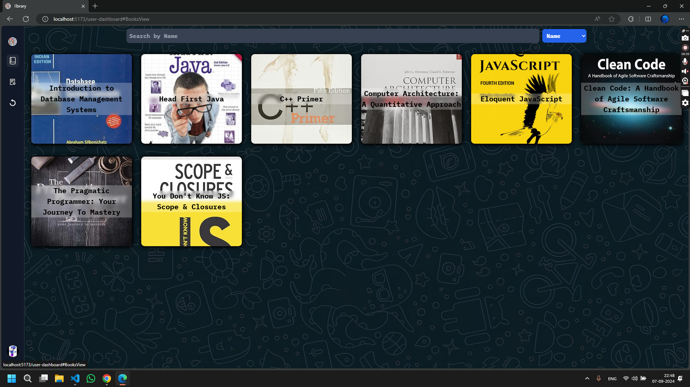

# Project structure

# BACKEND
    • .env
    • .gitignore
    • AdminRegister.js
    • index.js
    • package-lock.json
    • package.json
    • assets
      • not-admin.svg
      • not-found.svg
      • not-user.svg
    • models
      • Admin.js
      • Book.js
      • Borrow.js
      • index.js
      • User.js
    • routes
      • index.js
      • Admin
        • index.js
        • GET
          • adminNotFoundError.js
          • endPoint.js
          • invalidCookiesError.js
          • invalidCredentialError.js
          • methods.js
        • PUT
          • endPoint.js
          • invalidCookiesError.js
          • methods.js
          • updateProfilePicture.js
          • updateTextFields.js
      • Books
        • index.js
        • AdminRouter
          • index.js
          • GET
            • endPoint.js
            • getBookData.js
            • invalidCookiesError.js
            • invalidRequestError.js
            • methods.js
          • POST
            • endPoint.js
            • insertNewBook.js
            • invalidCookiesError.js
            • invalidMimeTypeError.js
            • invalidRequestError.js
            • methods.js
          • PUT
            • endPoint.js
            • invalidCookiesError.js
            • invalidRequestError.js
            • methods.js
            • updateBorrowDetails.js
        • GET
          • endPoint.js
      • BorrowBook
        • index.js
        • AdminsRouter
          • index.js
          • DELETE
            • deleteBorrowRequest.js
            • endPoint.js
            • invalidCookiesError.js
            • invalidRequestError.js
            • methods.js
          • GET
            • endPoint.js
            • getBorrowData.js
            • invalidCookiesError.js
            • methods.js
        • GET
          • badRequestError.js
          • endPoint.js
          • invalidCookiesError.js
          • methods.js
        • POST
          • duplicateBorrowRequestError.js
          • endPoint.js
          • invalidCookiesError.js
          • invalidRequestError.js
          • invalidUserIdError.js
          • methods.js
      • Images
        • AdminAvatar.js
        • ClientAvatar.js
        • CoverPages.js
        • index.js
      • User
        • index.js
        • DELETE
          • endPoint.js
          • methods.js
        • GET
          • endPoint.js
          • invalidCookiesError.js
          • invalidCredentialError.js
          • methods.js
          • userNotFoundError.js
        • POST
          • duplicateCredentialError.js
          • endPoint.js
          • invalidCredentialError.js
          • invalidMimeTypeError.js
          • methods.js
        • PUT
          • endPoint.js
          • invalidCookiesError.js
          • methods.js
          • updateProfilePicture.js
          • updateTextFields.js
    • validator
      • BookCopyValidator.js
      • BookValidator.js
      • BorrowDetailsObject.js
      • BorrowRequestValidator.js
      • ClientUpdateRequestValidator.js
      • ClientValidator.js
      • __ISBN__.js

# FRONTEND
    • .eslintrc.cjs
    • .gitignore
    • index.html
    • package-lock.json
    • package.json
    • postcss.config.js
    • README.md
    • tailwind.config.js
    • tsconfig.app.json
    • tsconfig.json
    • tsconfig.node.json
    • vite.config.ts
    • public
      • add-books.svg
      • avatar.svg
      • back.jpg
      • catalog.png
      • digital-resources.png
      • fall_back_cover.jpeg
      • invalid.svg
      • library.jpg
      • member.png
      • notFile.svg
      • vite.svg
    • src
      • App.css
      • App.tsx
      • index.css
      • main.tsx
      • vite-env.d.ts
      • assets
        • react.svg
      • Components
        • NoDataFound.tsx
        • Admin
          • AddBooks.tsx
          • AdminSettings.tsx
          • Book.tsx
          • BookView.tsx
          • BorrowAdminTable.tsx
          • BorrowAdminViewer.tsx
          • BorrowApproval.tsx
          • UserPreviewNavbar.tsx
        • Icon
          • AddBookIcon.tsx
          • ArrowLinkIcon.tsx
          • BooksViewIcon.tsx
          • BorrowIcon.tsx
          • ReloadIcon.tsx
          • ReturnIcon.tsx
          • UserIcon.tsx
        • User
          • Book.tsx
          • BooksView.tsx
          • Borrow.tsx
          • BorrowView.tsx
          • Settings.tsx
      • Options
        • BottomToastOption.ts
      • Pages
        • AdminAuthentication.tsx
        • AdminDashBoard.tsx
        • AdminUserPreview.tsx
        • HomePage.tsx
        • UserAuthentication.tsx
        • UserDashBoard.tsx
      • Validator
        • AdminLoginValidator.ts
        • AdminValidator.ts
        • BookCopy.ts
        • BookIdList.ts
        • BorrowDetailsValidator.ts
        • BorrowRequestObject.ts
        • BorrowResponseValidator.ts
        • ClientSignup.ts
        • UploadBookValidator.ts
        • UserValidator.ts
# Project preview

